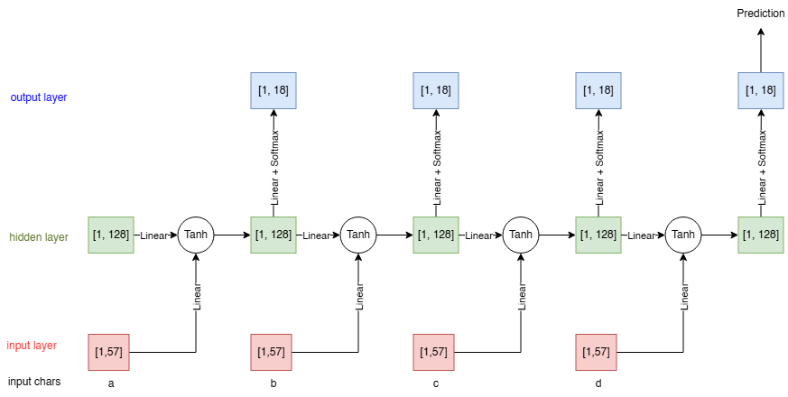
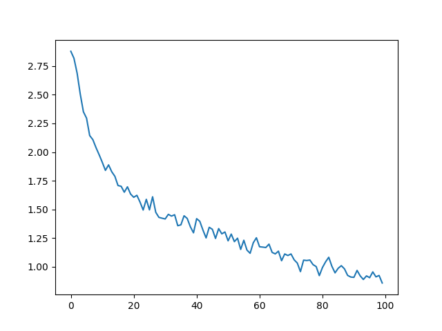

# Sentiment-Analysis


## RNN Basics



## Train
- Loss per training iteration (100K)



## Predict
```python
py predict.py NAME NUMBER_OF_PREDICTION
```
Example:
```
py predict.py Sushi 5

> Sushi
(-0.41) Japanese  
(-2.34) Vietnamese
(-2.47) Italian   
(-2.85) Polish    
(-3.18) Chinese   
```

## Reference 
- [Instruction](https://pytorch.org/tutorials/intermediate/char_rnn_classification_tutorial)